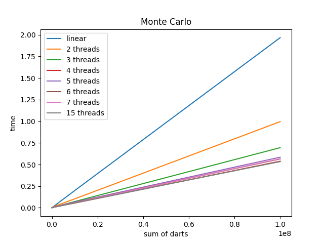
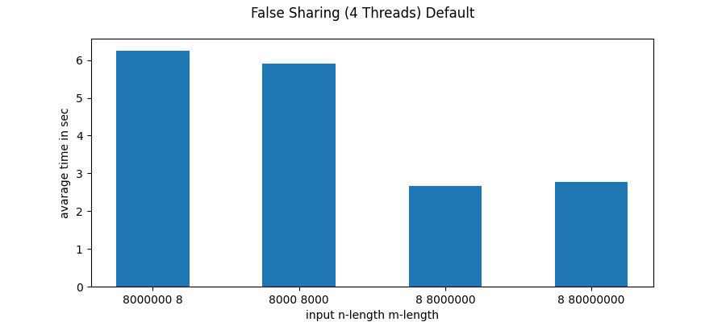
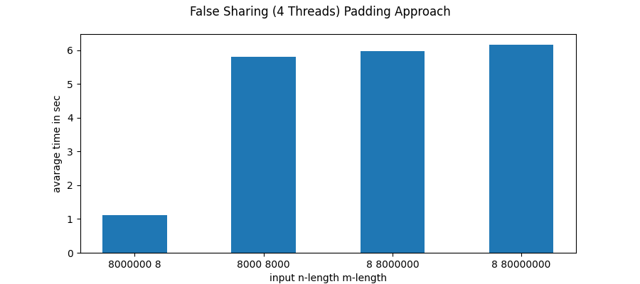
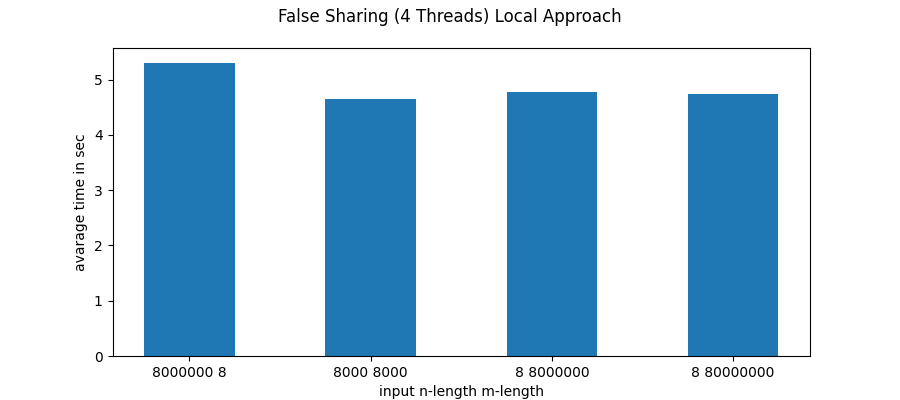

## 2022 Project 1

### Προσωπικά στοιχεία

__Όνομα__: Γεώργιος-Κωνσταντίνος Ζαχαρόπουλος

### Documentation

### Part1
#### Εκτέλεση:
* Θα πρέπει να βρισκόμαστε μέσα στον φάκελο programs/main και να εκτελέσουμε `make`. Έτσι θα φτιάξουμε τα εκτελέσιμα. Επειτα εκτελώντας `make run` το πρόγραμμα θα εκτελεστεί για είσοδο 10^8 5. Όπου 10^8 το πλήθος το ρήψεων και 5 ο αριθμός των threads. Μπορείτε να αλλάξετε τα ορίσματα από το Μakefile. Τέλος `make clean` και καθαρισμό των εκτελέσιμων. Μπορείτε να τρέξετε `make val` αφού έχετε φτιάξει τα εκτελέσιμα για να τρέξετε με valgrind και να ελέγξετε για leaks, το πρόγραμμα θα τρέξει για είσοδο 10^8 5.
---

### Λογική υλοποίησης:
#### Monte Carlo linear
* Στην απλή περίπτωση της σειριακής εκτέλεσης του αλγόριθμου απλά ακολούθησα τον ψευδοκώδικα.
#### Μonte Carlo Parallel with threads
* Στην παράλληλη εκδοχή του αλγόριθμου χώρισα το πλήθος των ρήψεων ανάλογα σε κάθε thread. Επειτα το κάθε thread ξεχωριστά υπολογίζει τον αριθμό των βέλων εντός κύκλου και τον καταγράφει. Το main thread όταν κάνει join για κάθε thread διαβάζει και τον αριθμό βέλων εντός κύκλου από την ξεχωριστή δομή που έχει το thread και υπολογίζει την εκτίμηση του π. Δεν χρειάζεται κάποιος συγχνονισμός καθώς τα threads δουλέουν και αποθηκεύουν σε ξεχωριστή μνήμη.

### Γράφημα απόδοσης του αλγορίθμου Monte Carlo

#### Παρατηρήσεις:
Γνωρίζουμε πως το σύστημα στο οποίο δουλέυουμε έχει 4 πυρήνες οπότε περιμένουμε και μια σχετικά καλή βελτίωση του χρόνου αν χρησιμοποιήσουμε 4 νήματα. Βλέπουμε πως όντως μέχρι και τα 4 threads υπάρχει πολύ καλή βελτίωση στον χρόνο. Όμως όσο προχωράμε και χρησιμοποιούμε περισσότερα νήματα δεν βλέπουμε μείωση στον χρόνο κάτι που είναι και αναμενόμενο.

 ---

### Part 2
#### Εκτέλεση:
Παρόμοια θα πρέπει να βρισκόμαστε μέσα στον φάκελο Local και Padding αντίστοιχα και να εκτελέσουμε `make` και `make run` για να τρέξουμε το προγραμμά μας. Πάλι μπορείτε να αλλάξετε την είσοδο από το Μakefile και να τρέξετε `make clean` και `make val`.
Αρχικά βλέπουμε τα αποτελέσματα του δοθέντος προγράμματος:
#### **False sharing**

Παρατηρούμε ότι ο χρόνος αυξάνεται σημαντικά όταν έχουμε μικρό m και αυτό γιατί πραγματοποιείται εκεί συχνά false sharing, δηλαδή κάθε thread πάει και γράφει σε μνήμη την οποία έχουν πάρει και τα υπόλοιπα threads.

Υπάρχουν 2 τρόποι για να το αποφύγουμε αυτό: 
#### **Με padding**
Πάμε και συμπληρώνουμε με εικονικά στοιχεία κάθε θέση του y ώστε να έχει μέγεθος 64 bytes όσο και το cache line, με αποτέλεσμα το κάθε thread να μην παίρνει στο cache line του στοιχεία που δεν του αναλογούν. Αυτό το έκανα δημιουργώντας ένα struct με μέγεθος όσο και το cache line και αλλάζοντας τον τύπο του y vector σε αυτό το struct.

Παρατηρούμε σημαντική μείωση στην περίπτωση που έχουμε μικρό m, όμως και μια αύξηση στους χρόνους όταν έχουμε μεγαλύτερο m. Αυτό γίνεται μιας και θα χρειαστεί να γίνουν πολλά περισσότερο cache line requests στους μεγαλύτερους πίνακες. Οπότε βλέπουμε ότι έχουμε να επιλέξουμε μεταξύ ενός trade off για την κάθε επιλογή μας.

#### **Mε χρήση local μεταβλητής**
Αν χρησιμοποιήσουμε το stack του thread τότε μπορούμε να μειώσουμε το false sharing. Δημιουργούμε μια τοπική μεταβλητή σε κάθε thread και κάνουμε σε αυτήν τους υπολογισμούς του πολλαπλασιασμού. Και όταν ολοκλήρωνουμε αντιγάφουμε το αποτέλεσμα. Ετσι ελαχιστοποιούμε όσο είναι δυνατό τα access στην global variable y που προκαλούν το false sharing.

Στην πρώτη περίπτωση στην οποία και δίνουμε την προσοχή μας αφού εκεί παρατηρείται το μεγαλύτερο false sharing στο αρχικό πρόγραμμα, βλέπουμε μια μικρή βελτιστοποίηση στους χρόνους. Τέλος βλέπουμε πως στα μεγαλύτερα m έχουμε λίγο καλύτερη επίδοση σε σχέση με το padding.

#### Σχόλια:
* Μέσα στους φακέλους υπάρχουν και οι χρόνοι εκτέλεσεις για κάθε πρόγραμμα.
* Τα αντίστοιχα διαγράμματα έγιναν με χρήση python plots.

### Πληροφορίες
* Ονομα υπολογιστικού συστήματος: linux03 της σχολής
* Μοντέλο επεξεργαστή: Intel(R) Core(TM) i5-6500 CPU @ 3.20GHz
* Αριθμός πυρήνων: cpu cores 4
* Εκδοση λειτουργικού συστήματος: Ubuntu 18.04.6 LTS
* Εκδοση μεταγλωττιστή: gcc (Ubuntu 7.5.0-3ubuntu1~18.04) 7.5.0
* Cache line: 64 bytes
 ---