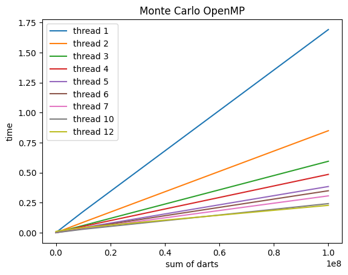
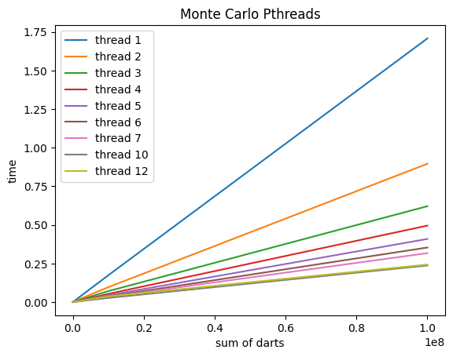
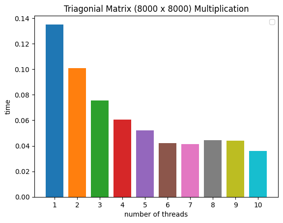
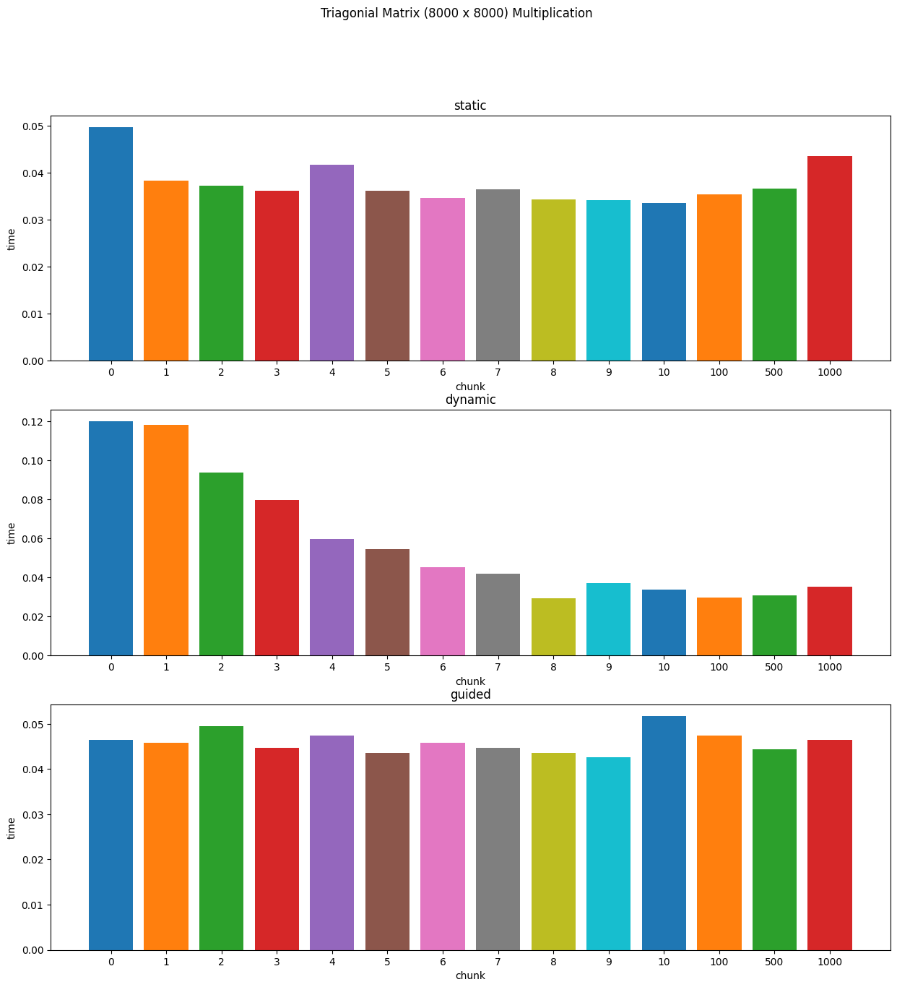

## 2022 Project 2

### Προσωπικά στοιχεία

__Όνομα__: Γεώργιος-Κωνσταντίνος Ζαχαρόπουλος

__Α.Μ.__: sdi1900061

### Documentation

### Part1
#### Εκτέλεση:
* Αρχικά θα πρέπει να βρισκόμαστε μέσα στον φάκελο programs/main και να εκτελέσουμε `make`. Έτσι θα φτιάξουμε τα εκτελέσιμα.
    * Έχουμε την επιλογή να εκτελέσουμε `make run` έτσι ώστε το πρόγραμμα να εκτελεστεί για είσοδο 10^8 6. Όπου 10^8 το πλήθος το ρήψεων και 6 ο αριθμός των threads. Μπορείτε να αλλάξετε τα ορίσματα από το Μakefile.
    * Αλλιώς μπορείτε να τρέξετε το script run.py ώστε το πρόγραμμα να εκτελεστεί πολλές φορές για μια σειρά ορισμάτων. Επίσης θα δημιουργηθεί και η γραφική παράσταση με τους χρόνους εκτέλεσης.

**Σημείωση 1** : To script δεν μπορεί να τρέξει στο περιβάλλον των linux της σχολής λόγω παλιάς έκδοσης python. Αν θέλετε απλά να ελέγξετε την ορθότητα του προγράμματος τρέξτε το με `make run`.  

**Σημείωση 2** : Στο script υπάρχουν ορισμένες commented εντολές, οι οποίες άμα τις κάνετε uncomment θα φτιάξουν ένα αρχείο store.txt με όλα τα αποτελέσματα από τα οποία θα δημιουργηθούν και τα plots. Αυτό το αρχείο υπάρχει ήδη από την φορά που τα έτρεξα εγώ. Άμα θέλετε να δείτε τα αποτελέσματα μπορείτε να το κάνετε overwrite.

* Τέλος `make clean` και καθαρισμό των εκτελέσιμων. Μπορείτε να τρέξετε `make val` αφού έχετε φτιάξει τα εκτελέσιμα για να τρέξετε με valgrind και να ελέγξετε για leaks, το πρόγραμμα θα τρέξει για είσοδο 10^8 6.
---

### Λογική υλοποίησης:
#### Monte Carlo Openmp
Σπάμε το πλήθος των ρήψεων σε ισάριθμα μεγέθη για κάθε ένα νήμα. Χρησιμοποιώντας την εντολή `#pragma omp parallel num_threads(thread_count)` καταφέρνουμε να φτιάξουμε thread_count νήματα για να τρέξουν παράλληλα. Επίσης με την εντολή `reduction(+: darts_in_circle)` κάνουμε σαφές ότι δεν θα πραγματοποιηθεί race condition στον μετρητή darts_in_circle και ότι στο τέλος ο μετρητής θα έχει τον σωστό συνολικό αριθμό ρήψεων μέσα στον κύκλο για όλα τα threads.

### Γράφημα απόδοσης του αλγορίθμου Monte Carlo

  

#### Παρατηρήσεις:
Γνωρίζουμε πως το σύστημα στο οποίο δουλέυουμε έχει 6 πυρήνες οπότε περιμένουμε και μια σχετικά καλή βελτίωση του χρόνου αν χρησιμοποιήσουμε 6 νήματα. Βλέπουμε πως όντως μέχρι και τα 6 threads υπάρχει πολύ καλή, σχεδόν γραμμική, βελτίωση στον χρόνο. Όμως όσο προχωράμε και χρησιμοποιούμε περισσότερα νήματα βλέπουμε πολύ μικρότερη μείωση στον χρόνο, μάλιστα μετά από έναν αριθμό threads και πάνω σταθεροποιούνται οι χρόνοι (για threads 10 και 12). Αυτό είναι και αναμενόμενο μιας και δημιουργείται μεγάλο overhead στο έλεγχο (συγχρονισμό) των νημάτων.

### Σύκριση με το πρόγραμμα υλοποιημένο σε Pthreads

  

  

Φαίνεται στο παραπάνω διάγραμμα ότι οι χρόνοι είναι αρκετά παρόμοιοι και στις δύο προσεγγίσεις. Αν κοιτάξουμε λίγο πιο προσεκτικά τις ίδιες τις μετρήσεις μπορούμε να δούμε ότι με OpenMP έχουμε λίγο καλύτερη επίδοση. Συγκεκριμένα στο παρακάτω πινακάκι βλέπουμε αυτή την μικρή διαφορά μεταξύ των δύο προσεγγίσεων.

    Pthreads  Threads 6                       OpenMP Threads 6
    Sum of dart     Time                      Sum of darts    Time
    10^4            0.00082175                10^4	          0.00041524999999999993
    10^5            0.0011610000000000001     10^5            0.000736
    10^6            0.00415175                10^6            0.004177999999999999
    10^7            0.03680875                10^7            0.03570324999999999
    10^8            0.35364375                10^8            0.34470575000000003

---

### Part2
#### Εκτέλεση:
* Παρόμοια μπορείτε να εκτελέσετε και το 2ο κομμάτι της εργασίας απλά τώρα χρειάζεται απλά να βρίσκεστε στον φάκελο Part2/.

**Σημείωση 3** : έχει τροποποιηθεί και η είσοδος στο πρόγραμμα. 
  * Ως ορίσματα ARGS έχουμε: `<thread_count> <m> <n> <type> <chunk_size>` όπου type : {dynamic, static, guided, auto} και chunk_size >= 0
  * Τα αρχικά ορίσματα του makefile είναι 6 8000 8000 auto 0, τα οποία και μπορείτε να αλλάξετε. Δεν είναι τα βέλτιστα.

### Λογική υλοποίησης:
Αρχικά άλλαξα την είσοδο που περιμένει το πρόγραμμα στην συνάρτηση `Get_args`. Έπειτα επειδή το πρόγραμμα αναφέρεται μόνο σε άνω τριγωνικούς πίνακες στην `malloc` για τον πίνακα **Α** δεσμεύεται μόνο όση μνήμη απαιτεί ένας τέτοιος πίνακας.  Ουσιαστικά χρησιμοποιείται η formula $-\frac{1}2 * (n+1) * (n -2m)$  για το άθροισμα $\sum_{i=0}^{n} m-i$, όπου m οι γραμμές και n οι στήλες.

### Απόδοση
Στην αρχή θα ελέγξουμε πως βελτιώνεται η απόδοση του προγράμματος με την αύξηση των threads.

  

Το παραπάνω γράφημα έγινε με την χρήση `auto scheduler` και μπορούμε να δούμε πως αυξάνεται σημαντικά η ταχύτητα καθώς αυξάνουμε των αριθμό των νημάτων. Συγκεκριμένα με την χρήση 10 threads χρειαζόμαστε χρόνο της τάξης 0.035.

Το επόμενο βήμα θα ήταν να δούμε μήπως οι άλλοι schedulers θα μπορούσαν να μας προσφέρουν καλύτερη απόδοση. Με βάση την βιλιογραφία ξέρουμε πως όταν το κόστος των επαναλήψεων μειώνεται ή αυξάνεται γραμμικά τότε συνήθως η καλύτερη επιλογή είναι ο `static scheduler` με ένα μικρό chunk. Παρόλα αυτά θα τους ελέγξουμε όλους χρησιμοποιώντας το `schedule(runtime)` και την συνάρτηση `omp_set_schedule`.

Για τον ίδιο πίνακα μεγέθους (8000 x 8000) χρησιμοποιώντας 6 threads, έχουμε τις παρακάτω μετρήσεις:

  

Οι μετρήσεις μας δείχνουν ότι τελικά ο `dynamic scheduler` έχει καλύτερη επίδοση σε σχέση με τον `static`. Συγκεκριμένα
βλέπουμε πως τα top 5 αποτελέσματα είναι τα εξής:

    Time                   Type     Chunk
    0.029365000000000002  dynamic     8
    0.029777333333333333  dynamic     100 
    0.030809833333333333  dynamic     500
    0.033539333333333333  static      10
    0.033841166666666677  dynamic     10

Οπότε τελικά βλέπουμε πως η βέλτιστη επιλογή scheduler είναι η dynamic με chunk 8. Αυτό μπορεί να δικαιολογηθεί ως εξής. Επειδή το workload balance δεν είναι καλά ισαμοιρασμένο στην for loop υπάρχει περίπτωση να υπάρχουν threads που να περιμένουν να τελειώσουν τα άλλα για να μπορέσουν συνεχίσουν στην περίπτωση της static επιλογής. Αντίθετα με την χρήση dynamic και της τεχνικής first come first served που χρησιμοποιεί αυτός o scheduler, όταν τελειώνει το ένα νήμα δεν περιμένει τα άλλα οπότε εκεί κερδίζει αυτή η επιλογή. Το overhead που υπάρχει στην επιλογή dynamic για τον συγχρονισμό των νημάτων φαίνεται να μην επηρεάζει τόσο στην περίπτωσή μας.

---

#### Σχόλια:
* Οι μετρήσεις έγιναν σε προσωπικό μηχάνημα αλλά το πρόγραμμα έχει ελεγχθεί ότι τρέχει και στα λίνουξ της σχολής.

### Πληροφορίες για το σύστημα που έγιναν οι μετρήσεις
* Ονομα υπολογιστικού συστήματος: WSL
* Μοντέλο επεξεργαστή: AMD Ryzen 5 3600 6-Core Processor
* Αριθμός πυρήνων: cpu cores 6
* Εκδοση λειτουργικού συστήματος: Ubuntu 16.04.7 LTS
* Εκδοση μεταγλωττιστή: gcc (Ubuntu 5.4.0-6ubuntu1~16.04.12) 5.4.0
* Cache line: 64 bytes
 ---