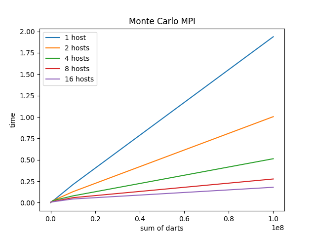

## 2022 Project 3

### Προσωπικά στοιχεία

__Όνομα__: Γεώργιος-Κωνσταντίνος Ζαχαρόπουλος

### Documentation

### Part1
#### Μεταγλώττιση και εκτέλεση:
Αρχικά θα πρέπει να βρισκόμαστε μέσα στον φάκελο Part1/programs/main.

* Εκτέλεση:
    * Τότε μπορούμε να εκτελέσουμε `make run_hosts`. Το πρόγραμμα θα τρέξει στα μηχανήματα(hosts) linux02,linux03,linux04,linux05 και θα ξεκινήσει 4 (n) διεργασίες. Έχει ως είσοδο το πλήθος ρίψεων 10^8. Mπορείτε να αλλάξετε τo όρισμα από το Μakefile.

    * Επίσης μπορούμε και με την εντολή `make run_machines` να τρέξουμε το πρόγραμμα. Θα χρησιμοποιηθεί το αρχείο machines στο οποίο εμπεριέχονται οι διαθέσιμοι κόμβοι και θα ξεκινήσουν 4 (n) διεργασίες.

* Καθαρισμός αρχείων και valgrind
    * Τέλος `make clean` και καθαρισμό των εκτελέσιμων. Μπορείτε να τρέξετε `make val` αφού έχετε φτιάξει τα εκτελέσιμα για να τρέξετε με valgrind και να ελέγξετε για leaks, το πρόγραμμα θα τρέξει για είσοδο 10^8.
---

### Λογική υλοποίησης:

### Μonte Carlo MPI

Σπάμε το πλήθος των ρίψεων σε ισάριθμα μεγέθη για κάθε έναν κόμβο. Χρησιμοποιώντας την εντολή **MPI_Bcast** ενημερώνουμε τους κόμβους για μέγεθος τις δουλειάς τους. Έπειτα κάθε κόμβος εκτελεί τον αλγόριθμο του monte carlo ξεχωριστά και με την εντολή **MPI_Reduce** ο συνολικός αριθμός ρίψεων εντός του κύκλου αθροίζεται στον root.

---
### Γραφήματα του αλγορίθμου Monte Carlo με MPI

#### Γράφημα χρόνων

  

#### Παρατηρήσεις:
Μπορούμε να δούμε σημαντική μείωση στον χρόνο όσο αυξάνουμε τους κόμβους που χρησιμοποιούμε.

#### Γράφημα επιτάχυνσης

  

#### Παρατηρήσεις:
Παρατηρούμε ότι για περισσότερους κόμβους έχουμε και μεγαλύτερη επιτάχυνση σε σχέση με το σειριακό αλγόριθμο.

#### Γράφημα απόδοσης

  

#### Παρατηρήσεις:
Ενώ όσο αφορά την απόδοση βλέπουμε πως όταν χρησιμοποιούμε 2 και 4 διεργασίες η απόδοση του προγράμματος φτάνει αυτή του γραμμικού. Ενώ μετά όσο αυξάνουμε τις διεργασίες η απόδοση μειώνεται αισθητά.

### Σχόλια
Υπάρχει ένας φάκελος programs/main/time στον οποίο βρίσκονται οι χρόνοι για τις διαφορετικές εισόδους.

---

### Part2
#### Μεταγλώττιση και εκτέλεση:
Αρχικά θα πρέπει να βρισκόμαστε μέσα στον φάκελο Part2/

* Η εκτέλεση, ο καθαρισμός των αρχείων και ο έλεγχος για leaks γίνεται με τον ίδιο τρόπο (ίδιες εντολές).

* Η είσοδος στο πρόγραμμα έμεινε ίδια, δηλαδή με scanf δίνεται εσείς τις διαστάσεις που θέλετε.
### Λογική υλοποίησης:

Επέλεξα ο root να δημιουργεί τον matrix και το vector. Στην συνέχεια επειδή θέλουμε να στείλουμε ανά στήλες και όχι ανά γραμμές, ο root φτιάχνει temp matrices και vectors με τα κατάλληλα στοιχεία και τα στέλνει στα processes με την εντολή **MPI_Send**. Επειτα τα processes με **MPI_Recv** παίρνουν τον matrix και το vector. Πολλαπλασιασμό κάνουν όλες οι διεργασίες και ο root. Μόλις όλοι έχουν υπολογίσει το κομμάτι του πίνακα που τους αναλογεί με την εντολή **MPI_Reduce** αθροίζονται τα αποτελέσματα στον root.

### Πληροφορίες για τα συστήματα που έγιναν οι μετρήσεις
Ονόματα υπολογιστικών συστημάτων: linuxΧΧ της σχολής
* Μοντέλο επεξεργαστή: Intel(R) Core(TM) i5-6500 CPU @ 3.20GHz
* Αριθμός πυρήνων: cpu cores 4
* Εκδοση λειτουργικού συστήματος: Ubuntu 18.04.6 LTS
* Εκδοση μεταγλωττιστή: gcc (Ubuntu 7.5.0-3ubuntu1~18.04) 7.5.0
* Cache line: 64 bytes
